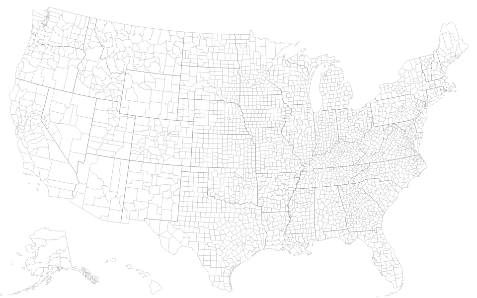
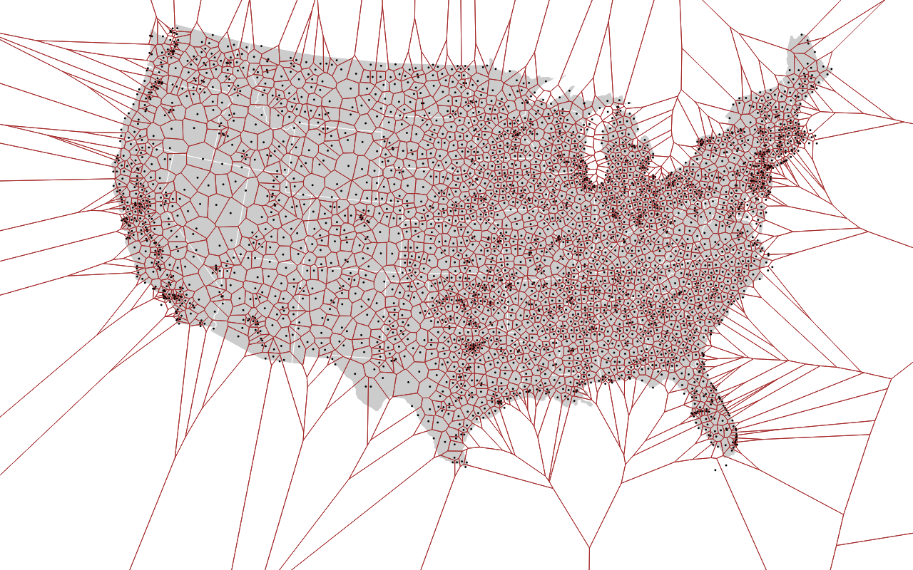

# pretty-data

This module allows the generation of [D3](https://d3js.org) visualizations on the server.

Visualizations can be exported in HTML, SVG or PNG (via [PhantomJS](http://phantomjs.org/)).

## Examples

### US TopoJSON

Source: [https://bl.ocks.org/mbostock/4136647](https://bl.ocks.org/mbostock/4136647).

### Voronoi

Adapted from: [http://mbostock.github.io/d3/talk/20111116/airports-all.html](http://mbostock.github.io/d3/talk/20111116/airports-all.html).

